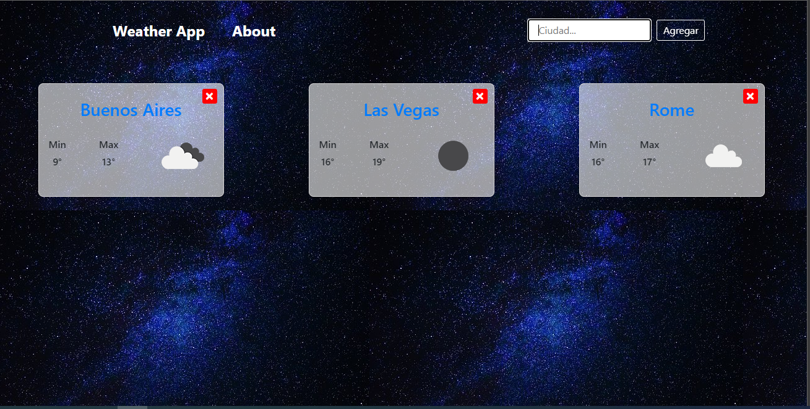

## WeatherAPP 

  Application made in the Front End module of Soy Henry bootcamp obtaining
  the data from Weather API. Technologies used were React, Javascript and
  CSS modules for its design. With this app you will be able to see the weather of all
  the cities in the world.

 You can visit the web in this Link : https://nm-weatherapp.netlify.app/

  

